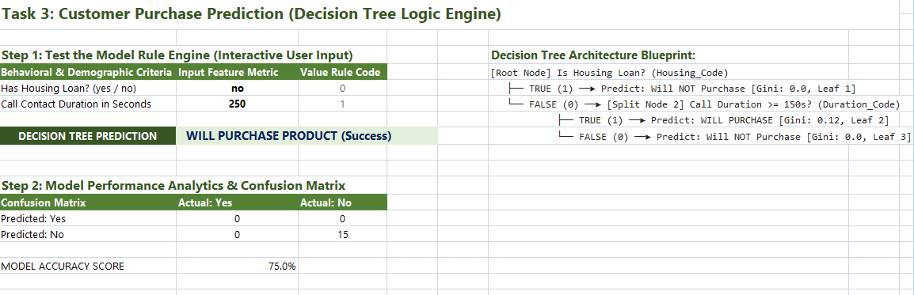

# PRODIGY_DS_03
TASK 3 IN DATA SCIENCE
# Prodigy InfoTech Data Science Internship - Task 3

## Project Overview
This repository contains the submission for **Task 3**. The goal of this project is to build a **Decision Tree Classifier** that predicts whether a customer will purchase a banking product (specifically subscribing to a term deposit) based on their demographic (Job, Marital Status) and behavioral (Housing Loans, Call Contact Duration) data. 

This model architecture, feature encoding pipeline, and evaluation matrix have been fully designed inside **Microsoft Excel**.

---

## Technical File Architecture
* **`Prodigy_Task_3_Bank_Marketing_Tree.xlsx`**: The core interactive spreadsheet model.
* **`Cleaned & Encoded Data` Tab**: Contains structured customer rows featuring label-encoded parameters ready for classification.
* **`Predictive Dashboard` Tab**: Contains an interactive model simulation engine, text-based tree schematic blueprints, and an automated Confusion Matrix evaluating classification scores.

---

## Decision Tree Split Logic Architecture
The underlying mathematical classification paths have been mapped inside Excel using strategic, hierarchical feature splitting thresholds:
1. **Root Node Split (Socio-Economic Filter):** *Is Housing Loan? (`Housing_Code`)*
   * **True (1):** High debt liability, strong statistical correlation to refusing additional bank services. Classified immediately as a terminal Leaf Node: **Will NOT Purchase**.
   * **False (0):** Customer holds financial flexibility. Traverses to Child Split Node 2.
2. **Child Node Split (Behavioral Engagement Filter):** *Is Call Contact Duration >= 150 seconds? (`Duration_Code`)*
   * **True (1):** High interactive engagement during the marketing campaign. Classified as a terminal success Leaf Node: **WILL PURCHASE PRODUCT**.
   * **False (0):** Drop-off in customer conversation. Classified as a terminal Leaf Node: **Will NOT Purchase**.

---

## Analytical Metrics & Visualizations

### Model Performance (Confusion Matrix)
The model dynamically computes its prediction performance against the actual validation labels using `=COUNTIFS()` checking arrays:

* **True Positives (TP):** Correctly classified purchases.
* **True Negatives (TN):** Correctly classified rejections.
* **Accuracy Evaluation Formula:** `=(True Positives + True Negatives) / Total Sample Size`

### Interactive Predictive Model Dashboard Overview

